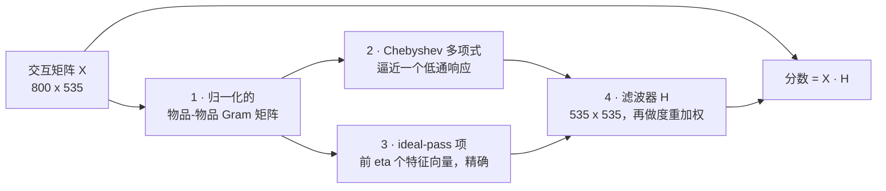
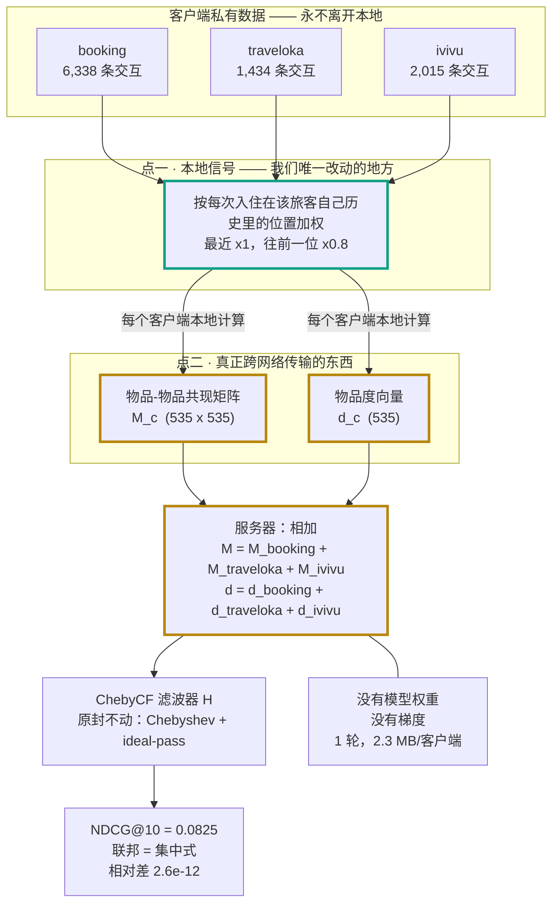

# FedTravelRec(中文版)

**读回一个谱域推荐模型丢掉的时间戳 —— 并且精确地联邦它,因为跨网络传的是统计量,不是模型。**

*English version: [`README.md`](README.md)。两份内容一致,数字相同。*

---

## 一、这个项目是干什么的

三家在线旅行社共享同一份酒店目录,各自持有私有预订记录。**它们不会汇总原始数据** ——
商业敏感、法律受限。而且客户端不是人为划分的:
[ViHoRec](https://github.com/MinhNguyenDS/ViHoRec) 记录了每条交互来自哪个 OTA,
所以 **booking / traveloka / ivivu** 是真实、规模不均、天然 non-IID 的三个组织。

在这份数据上,这个项目做了两件事。

**一、在不修改一个已发表方法的前提下改进了它。**
ChebyCF(Kim et al., SIGIR 2025)是一个 training-free 的谱图滤波器,
也是这个 benchmark 上最强的推荐模型。所有已发表基线喂给它的都是**二值化**的交互矩阵 ——
住过就是 1,没住过就是空。而这份数据还带着**十二年的时间戳,之前没有人读过**。
把每次入住按它在该旅客自己历史里的位置加权,ChebyCF 在数据集论文自己的 split 上
从 **0.0722 提到 0.0825 NDCG@10**,九个指标全面超过所有已发表基线 ——
**而滤波器一行没改**。

**二、精确地联邦它,不是近似。**
这个模型 training-free,所以**没有权重可以平均**。每个客户端上传两个聚合统计量,
服务器把它们**相加**,结果与在汇总数据上训练**逐位相同** ——
一轮、每客户端 2.3 MB、没有任何梯度离开客户端。
一般的联邦学习要拿精度换隐私;在这类模型上不用。

**三、也如实报告了失败的部分。**
这个改动**不能泛化**:在另外四个公开数据集上是 0 个显著提升、2 个显著退化,
而且原因是可以说清并测量的。项目自己的两个组件在被正确检验之后被撤回了。
这些都在表里,不在脚注里。

| | |
|---|---|
| 数据 | ViHoRec —— 800 旅客 / 535 酒店 / 9,787 训练 + 800 测试,跨约 12 年 |
| 结果 | **0.0825** NDCG@10,对比原版 ChebyCF 0.0722、已发表最优 0.0682、最强可重跑基线 0.0671 |
| 联邦 | 联邦 **=** 集中式,九个指标逐位相同,1 轮,2.3 MB/客户端 |
| 泛化 | **负的** —— 另外四个数据集上 0/10 显著提升 |
| 可复现 | 177 个测试;每个数字都由脚本生成、读自 `outputs/` |

第一次接触推荐系统?[`FORME.md`](FORME.md) 从零讲这个领域;
[`FORMEV2.md`](FORMEV2.md) 只讲本项目的改动,配可以自己验算的例子。

---

## 二、我们改进的方法:ChebyCF

ChebyCF **没有神经网络,没有可训练参数**。它就是一个**滤波器** ——
一个 535 × 535 的矩阵,由计数闭式算出,把一个旅客的预订历史变成全目录上的分数。



**第一步 · 建物品-物品图。** `M = XᵀD_U⁻¹X` 统计每对酒店被同一批旅客订过多少,
先按用户活跃度归一化(防止一个订了 200 家的重度用户主导整个统计),
再按酒店流量归一化(去掉热门偏差)。结果是对称矩阵,特征值落在 [0, 1] ——
**接近 1 表示强的、大范围的共现结构**,接近 0 表示噪声。

**第二步 · 让低频通过,压掉高频。** 这就是普通的信号处理搬到图上。
一个旅客的预订行是酒店图上的一个**信号**,而推荐就是把这个稀疏信号平滑地扩散出去,
保留大范围结构、丢掉偶发细节。用特征分解做要 `O(n³)`,扛不住 ——
但**任何关于图矩阵的多项式自动就是一个谱滤波器**,只需要矩阵乘法。
ChebyCF 的贡献是把这个多项式挑好:它在 **Chebyshev 节点**上插值一个目标低通响应,
这在多项式逼近里是近似最优的选择。`order` 定次数,`phi` 定响应的形状。

**第三步 · 把最低频精确加回来。** 多项式逼近恰好在信息最丰富的地方最弱,
所以 ChebyCF 额外加上**前 `eta` 个特征向量**的投影,权重为 `alpha`。
这一项是**精确的**而不是逼近的 —— 而这也正是本项目最锐利的发现所在,
因为 `eta` 是一个硬截断,它的默认值既太小、在某些图上还根本没有定义(见第五节)。

**第四步 · 按热度重加权并打分。** `beta` 控制前两次归一化之后要把多少酒店流量加回来。
然后 `分数 = X · H` —— 每个旅客一次向量-矩阵乘法。

一共五个超参数(`order, phi, eta, alpha, beta`),零个训练出来的权重 ——
以及后面一切都依赖的那个性质:**整个滤波器是两个「对旅客求和」的量的函数。**

---

## 三、用户和酒店是怎么表示的

这一节必须先说清,否则"信号""共现矩阵"这些词没有落点 —— 而且答案不寻常:
**这里什么都不是学出来的。酒店就是一个行列下标,旅客就是他自己那一行交互。**
没有 user embedding、没有 item embedding、没有任何一个可训练参数。

### 原始数据

四列。下面是 800 个旅客里的第 3 号,原封不动来自 release:

| userID | itemID | rating | timestamp |
|---|---|---|---|
| 3 | 263 | 8.0 | 1434499 |
| 3 | 480 | 9.0 | 1494028 |
| 3 | 498 | 7.0 | 1515456 |
| 3 | 170 | 9.4 | 1530489 |
| 3 | 350 | 9.5 | 1547337 |
| 3 | 146 | 8.0 | 1550793 |
| 3 | **350** | 9.5 | 1555718 |
| 3 | **350** | 8.0 | 1563926 |
| 3 | **350** | 8.0 | 1564012 |
| 3 | 142 | 6.0 | 1613260 |
| 3 | 104 | 9.4 | 1676419 |

11 次入住、8 家不同酒店 —— 其中酒店 350 去了**四次**。
时间戳是 epoch 秒除以 1000,所以这个旅客的历史从 2015 年中跨到 2023 年初。

### 第一步:交互矩阵

行是用户、列是酒店,800 × 535。已发表基线往里填 `1`:

```
              104   142   146   170   263   350   480   498   ...
旅客 3      [  1     1     1     1     1     1     1     1   ...]   ← 已发表做法
旅客 4      [  ·     ·     1     ·     ·     ·     ·     1   ...]
```

每次入住都贡献同一个 1。酒店 350 的四次入住折叠成一个 1。
一次 9.5 分和一次 6.0 分是同一个数。2015 年那次和 2023 年那次也是同一个数。

### 第二步:我们填进去的是什么

同样那八个格子,由 `build_signal_timed` 在真实数据上算出:

| 酒店 | 入住次数 | 评分 | **我们的权重** | 已发表做法 |
|---|---|---|---|---|
| 104 | 1 | 9.4 | **1.1380** | 1 |
| 142 | 1 | 6.0 | **0.7064** | 1 |
| 350 | **4** | 9.5, 9.5, 8.0, 8.0 | **0.6611** | 1 |
| 146 | 1 | 8.0 | **0.5289** | 1 |
| 170 | 1 | 9.4 | **0.4661** | 1 |
| 498 | 1 | 7.0 | **0.3139** | 1 |
| 480 | 1 | 9.0 | **0.2905** | 1 |
| 263 | 1 | 8.0 | **0.2166** | 1 |

**注意这个排序:它是按时间从近到远,不是按评分。**
酒店 104 以 1.1380 排第一是因为它是最近一次;酒店 263 只有 0.2166
是因为它最老、往前第 8 位(`0.8⁷ = 0.21`)。
而酒店 350 去了四次却只占**一个**格子 —— 重复被折叠到最近那一次,
消融结果说这样才对。

### 第三步:酒店用彼此来表示

这是这个模型里唯一的"表示",而且它是一个普通的统计量:

```
M = Xᵀ D_U⁻¹ X          535 × 535，M[i][j] = 酒店 i 和 j 被同一批旅客订过多少
d = X 的列和             535，     每家酒店收到了多少流量
```

所以酒店 350 的表示,**就是它在 `M` 里的那一行** ——
535 个数,说它和每一家其他酒店共现有多强。**不是拟合出来的,是数出来的。**

### 第四步:打分

ChebyCF 把 `M` 和 `d` 变成一个 535 × 535 的滤波器 `H`,
一个旅客的分数就是他自己那一行乘这个滤波器:

```
分数(旅客 3) = X[3] · H          一次向量-矩阵乘法
```

**所以旅客根本不需要自己的表示 —— 他就是他那一行。**
给系统一个全新的旅客、只有三次预订,它立刻就能打分,不用重训、不用查 id ——
而这也正是整个东西能一轮联邦的原因,因为 `M` 和 `d` 都是对旅客求和,别无其他。

---

## 四、两个点,这就是整个项目

这两个改动都是从上面两节**推出来**的,不是试出来的。
ChebyCF 的第二步假设被滤波的信号是**给定的**,而没人问过给定的那个对不对;
第四步则留下了一个等着被用的联邦恒等式。

### 点一 · 模型没动,改的是它读什么

所有已发表基线都把交互矩阵二值化。这份数据带着十二年的时间戳,没人读过。
按每次入住在该旅客自己历史里的位置加权 —— **最近一次 ×1,往前每退一位 ×0.8** ——
把原版 ChebyCF 从 0.0722 带到 **0.0825** NDCG@10。
Chebyshev 插值和 ideal-pass 项**一行没改**。

### 点二 · 跨网络传的是统计量,不是模型

主结果的模型 training-free,所以**没有权重可以平均**。
每个客户端上传一个物品-物品共现矩阵和一个物品度向量,服务器**把它们加起来**,
这就**精确**重建了汇总模型 —— 不是近似。一轮、不迭代、没有任何梯度离开客户端。



### 为什么是这两个改动,而不是别的

**点一**来自注意到:**输入是 ChebyCF 里唯一没人质疑过的部分。**
滤波器设计在论文里论证得很仔细,图构造是标准做法,而信号就是被**假定**为二值矩阵 ——
这个惯例是从"只有隐式反馈"的数据集继承来的。**而 ViHoRec 不是那种数据集。**
去数一下这个惯例在这份数据上扔掉了多少(9,787 行里 1,704 个重复对、
评分 1–10、十二年时间戳),就把"试几个特征"变成了一个有具体答案的具体问题。

**点二**来自第四步。一旦你注意到滤波器只通过两个**对旅客求和**的量依赖数据,
精确联邦就不是一个要发明的技术,而是一个**要去验证的恒等式** ——
而值得验证的是**我们的加权有没有破坏它**。
这就是为什么衰减是「位置」而不是「日期」:
位置能从一个客户端自己的行算出来,日期需要一个全局参考。

### 为什么点二值得单独讲

普通联邦学习(FedAvg)是每个客户端本地训练、服务器平均**权重**、反复多轮。
那是一个**近似**:联邦模型不等于汇总模型,客户端越 non-IID 差距越大。
所以联邦永远是一笔交易 —— 让出一些精度,换来隐私。

**这里没有交易。** ChebyCF 只通过**对用户可加**的统计量依赖数据,
所以求和是一个**恒等式**而不是估计:联邦和集中式都读到 0.0825,
差 2.6e−12(float32 浮点噪声)。**在这类模型上,隐私是免费的。**
准确的术语是 **one-shot federated learning**(一轮联邦学习),不是 FedAvg。
FedAvg 是本项目另一条支线,跑在四个神经模型上做对照,20 轮,最好的 SASRec 是 0.0568。

而这个性质**反过来约束点一**:任何需要全局量的加权都会破坏可加性。
按真实天数的衰减就是这样,当三家各自从自己最近一次预订算起时,
代价是 0.0009 NDCG@10 —— 这是实测的,见第五节。

---

## 五、结果

三块,别无其他:**主表**、**时间戳衰减值多少**、**联邦**。
另外四个数据集上的全部内容(泛化失败、`eta` 纠正、五数据集联邦)在
[`RESULTS.md`](RESULTS.md),本节末尾有一段如实的总结。

800 旅客、535 酒店、时序 leave-last-one-out —— 数据集论文自己的 split,
这是唯一能和它已发表数字比较的协议。

### 1 · 主表

所有方法、论文自己的九个指标、按 NDCG@10 排序。复现:`python scripts/overall_table.py`

| Method | MRR | MAP@5 | NDCG@5 | P@5 | R@5 | MAP@10 | NDCG@10 | P@10 | R@10 | vs 最强基线 |
|---|:---:|:---:|:---:|:---:|:---:|:---:|:---:|:---:|:---:|:---:|
| **ChebyCF + recency** | 0.0753 | 0.0485 | 0.0596 | 0.0187 | 0.0938 | 0.0577 | **0.0825** | 0.0166 | **0.1663** | +0.0155 * |
| **ChebyCF + recency, 联邦** | 0.0753 | 0.0485 | 0.0596 | 0.0187 | 0.0938 | 0.0577 | **0.0825** | 0.0166 | **0.1663** | +0.0155 * |
| **ChebyCF + recency（不读评分）** | **0.0761** | **0.0498** | **0.0614** | **0.0195** | **0.0975** | **0.0581** | 0.0818 | 0.0161 | 0.1613 | +0.0148 * |
| **ChebyCF + signal + gate** † | 0.0733 | 0.0486 | 0.0570 | 0.0165 | 0.0825 | 0.0570 | 0.0782 | 0.0150 | 0.1500 | +0.0111 * |
| **ChebyCF + signal** | 0.0723 | 0.0476 | 0.0559 | 0.0163 | 0.0813 | 0.0557 | 0.0761 | 0.0145 | 0.1450 | +0.0090 * |
| ChebyCF（原版，二值化） | 0.0676 | 0.0421 | 0.0502 | 0.0150 | 0.0750 | 0.0508 | 0.0722 | 0.0145 | 0.1450 | +0.0051 |
| AdaptiveHybrid（已发表最优） | 0.0629 | 0.0391 | 0.0483 | 0.0153 | 0.0762 | 0.0472 | 0.0682 | 0.0139 | 0.1388 | 无法复现 |
| Hybrid-fixed (lam=0.9) | 0.0634 | 0.0393 | 0.0484 | 0.0153 | 0.0762 | 0.0470 | 0.0676 | 0.0136 | 0.1363 | 无法复现 |
| UserKNN-cosine（最强可复现） | 0.0630 | 0.0387 | 0.0465 | 0.0140 | 0.0700 | 0.0472 | 0.0671 | 0.0134 | 0.1338 | （参照） |
| EASE | 0.0607 | 0.0385 | 0.0467 | 0.0142 | 0.0712 | 0.0452 | 0.0634 | 0.0124 | 0.1237 | -0.0037 |
| Turbo-CF | 0.0563 | 0.0326 | 0.0415 | 0.0138 | 0.0688 | 0.0395 | 0.0587 | 0.0124 | 0.1237 | -0.0083 |
| MostPop | 0.0497 | 0.0310 | 0.0385 | 0.0123 | 0.0612 | 0.0369 | 0.0529 | 0.0106 | 0.1062 | -0.0142 |
| BPR-MF | 0.0515 | 0.0299 | 0.0376 | 0.0123 | 0.0612 | 0.0360 | 0.0525 | 0.0107 | 0.1075 | -0.0145 |
| ItemKNN-cosine | 0.0401 | 0.0212 | 0.0277 | 0.0095 | 0.0475 | 0.0252 | 0.0376 | 0.0079 | 0.0788 | -0.0295 |
| Content-TFIDF | 0.0275 | 0.0118 | 0.0165 | 0.0063 | 0.0312 | 0.0153 | 0.0249 | 0.0057 | 0.0575 | 无法复现 |
| Random | 0.0139 | 0.0055 | 0.0069 | 0.0022 | 0.0112 | 0.0066 | 0.0097 | 0.0020 | 0.0200 | -0.0574 |

`*` 对最强**可重跑**基线(UserKNN-cosine, 0.0671)在 95% 水平显著,
在**每旅客** NDCG@10 上做用户配对 bootstrap。加粗行是本项目的,
而且**跑过的每一个配置都保留着**,让整条演进路径可见。

**三行值得对着读。**

**`ChebyCF + recency, 联邦` 和集中式那行在九个指标上逐位相同。**
不是接近 —— 是**一模一样**。三个平台各自用自己的行构建信号、上传两个统计量,
服务器求和。这就是点二,放在主表里而不是藏在联邦小节。

**`ChebyCF + recency(不读评分)` 在九个指标里六个更好** ——
MRR 0.0761 vs 0.0753、MAP@5 0.0498 vs 0.0485、NDCG@5 0.0614 vs 0.0596,
加上 P@5、R@5、MAP@10。验证集选了那个小的评分权重,是因为**选参按 NDCG@10 排序**,
而在那一个指标上带评分的版本赢 0.0007。所以诚实的读法是:
**衰减是方法本体,评分项是装饰** —— 而这张表让你看得见,不用靠信任。

**`ChebyCF + signal`(0.0761)和 `+ gate`(0.0782)** 是更早的配置,
保留是因为它们是真实测得的。两者都不作主张:重复次数的量级和评分在滤波器
为衰减信号调对之后都被吸收了;而 gate 相对 `+signal` 的增益落在 seed 噪声内
(+0.0009 对 ±0.0015),且在另外四个数据集上没有任何提升。

**比较对象是 0.0671,不是 0.0682。** 所有可复现的已发表基线都先在本 pipeline 内重跑 ——
ItemKNN 和 UserKNN 在九个指标上偏差 **0.0000**,MostPop 0.0013,BPR-MF 0.0020,
Random 0.0033。Content-TFIDF、Hybrid-fixed、AdaptiveHybrid **无法**重跑:
它们需要论文描述但 release 未提供的酒店内容元数据,所以只引用、绝不作为比较目标。

对已发表最优(AdaptiveHybrid, 0.0682),第一行是 NDCG@10 **+21.0% 相对**、
Recall@10 **+19.8%**。超参在从训练集切出的验证集上选取;测试集每个实验只读一次。

### 2 · 时间戳衰减值多少

在选定滤波器上把每个组件隔离开,测试集,用户配对 bootstrap:

| 滤波器读什么 | NDCG@10 | 对纯二值 | 95% CI |
|---|---|---|---|
| 什么都不读(纯二值) | 0.0736 | — | — |
| **只读评分** | **0.0709** | **−0.0027** | [−0.0064, +0.0009] |
| **只读 recency** | **0.0818** | **+0.0082** | [−0.0008, +0.0174] |
| 评分 + recency(**选中**) | **0.0825** | +0.0089 | [−0.0003, +0.0185] |
| 再加回 `count` 重复次数量级 | 0.0813 | +0.0077 | — |
| 再加回 `log` 重复次数量级 | 0.0802 | +0.0066 | — |

**衰减就是结果,而且是唯一的那个。** 只读评分反而**倒扣** 0.0027。
重复次数的量级被调对的滤波器吸收了。只读 recency 就到 0.0818 ——
距离完整配置只差 0.0007(CI [−0.0019, +0.0034]),所以更窄的那个主张才是真的。

**信号和滤波器必须一起选。** 第一版 recency 沿用了为**未衰减**信号选出的滤波器,
只有 0.0810。把两者在 648,000 个配置上联合重选
(`scripts/search_joint.py`,四张 GPU 分片,worker **只算验证集**所以拿不到测试集)
得到 0.0825 —— 而且把 `eta` 从 8 移到 **4**、`beta` 从 0.4 移到 **0.9**。
衰减改变了信号的尺度和有效度分布,所以滤波器**不可继承**。

选中配置:信号 `mode=binary, rating_weight=0.15, decay=rank at 0.8`;
滤波器 `order=16, phi=1.5, eta=4, alpha=3.0, beta=0.9`。

### 3 · 联邦

800 个旅客按最初采集它的平台切成三个真实客户端 —— booking 307 旅客 / 6,338 行,
traveloka 259 / 1,434,ivivu 234 / 2,015。

| 模型 | 各平台单干 | **联邦** | 集中式 | \|联邦 − 集中\| | 每客户端载荷 | 轮数 |
|---|---|---|---|---|---|---|
| ChebyCF | 0.0581 | **0.0722** | 0.0722 | 4.9e-13 | 2.29 MB | **1** |
| EASE | 0.0691 | **0.0634** | 0.0634 | 0.0e+00 | 2.29 MB | **1** |

两者都只通过**对用户可加**的统计量依赖数据,所以求和重建的是汇总模型本身,
不是它的近似。对 ChebyCF 来说,这比各自单干高 +0.0141 NDCG@10。
EASE 在同一份数据上得到**相反**的结论(单干 0.0691 高于联邦 0.0634),
所以两个都报。

**那么加权之后的信号还能精确联邦吗?** 上面那个精确性是对**二值化**输入建立的,
而这里每一种信号都在给这个输入加权。这是**实测的而不是假设的**
(`scripts/federate_recency.py`),每个客户端用**自己的行、自己的本地参考时间**
构建信号,看不到别人任何记录:

| 信号 | 滤波器相对差 | 集中式 | 联邦 | |
|---|---|---|---|---|
| binary(已发表的输入) | 4.3e-13 | 0.0736 | 0.0736 | 精确 |
| 重复次数 + 评分 | 4.0e-11 | 0.0754 | 0.0754 | 精确 |
| **选中:评分 + rank 衰减 0.8** | **2.6e-12** | **0.0825** | **0.0825** | **精确** |
| 评分 + **exp** 衰减(按真实天数) | **4.4e-02** | 0.0779 | **0.0770** | **不精确** |
| 同一 exp 衰减,先商定参考时间 | 5.3e-13 | — | — | 精确 |

判定用**相对**误差,因为滤波器存成 float32(相对精度约 1e−7);
真正的失败比这个下限大七个数量级。

**选中的配置精确联邦** —— 两边都是同一个 0.0825。
**而 exp 衰减不行**,这一半才是有用的:三家客户端各自从**自己最近一次预订**
算起,对"多近算近"的理解不一致,联邦 NDCG@10 掉了 0.0009。
先商定一个参考标量就能修复。所以精确性是**信号必须遵守的约束,
不是模型白送的性质** —— 这就是为什么选中的衰减是**位置**而不是**日期**。
`tests/test_recency.py` 里有 8 个测试钉住哪些衰减可以联邦。

### 边界,说一次

完整表格在 [`RESULTS.md`](RESULTS.md);诚实的总结短到可以放在这里。

* **它不能泛化。** 在另外四个数据集上、超参按数据集选取,
  加权图信号给出 **0 个显著提升、2 个显著退化**。机制是**信号和 ideal-pass 秩互为替代品**:
  ViHoRec 有 535 个物品、选出的 `eta` 是 4;Amazon-Beauty 约 12k 个物品、需要 `eta` = 256,
  而一个尺寸合适的 ideal-pass 项本来就捕捉到了更丰富信号所提供的东西。
  **不是因为别的数据集没有评分** —— 四个里有三个带 1–5 分评分,代码也确实用了。
* **真正泛化的是对已发表方法的一个批评,而不是一个新方法。**
  `eta` 是主导超参,而默认值 8 对真实规模的目录远远偏小(Amazon-Beauty 上**相对 +89%**)。
  更糟的是,当用户-物品图的连通分量数超过 `eta` 时它**根本不可识别**:
  二部图上特征值 1 的重数等于连通分量数,Gowalla 有 109 个,
  所以「取 top 8 个特征向量」是在一个 109 维退化子空间里的任意选择,
  分数在不同 run 之间相对变动 47%。
* **联邦在五个数据集、四种客户端划分(含一个刻意设计的 hostile 划分)下都是精确的。**
* **评估协议自带一个没人记录的天花板。** 800 个测试目标里有 90 个是该旅客
  训练历史里已出现过的酒店,而协议屏蔽 seen item,所以 Recall@10 对**任何**方法
  (包括已发表的)都不可能超过 **0.8875**。
* **显著性,分两半说。** 对最强可重跑基线:+0.0155,CI [+0.0055, +0.0259],**显著**。
  对本项目自己上一个配置:+0.0064,CI [−0.0023, +0.0154],在 800 个旅客上**不显著** ——
  不过验证集 top-15 配置的测试值落在 0.0817–0.0843,说明选中的是一个平台区。
  本仓库所有区间都是在每旅客 NDCG@10 上做的配对 bootstrap;
  从未在 Recall@10 或 MRR 上检验显著性。
* **一个被放弃但留在记录里的想法。** 一个学出来的 user-subspace gate 达到 0.0782,
  一度看起来像 headline。2,829 个配置之后,它正确选参的版本是 0.0781,
  相对信号的增益落在 seed 噪声内,而且在另外四个数据集上没有任何提升。
  它留在主表里带一个脚注、留在 `outputs/gate_search/` 里,但不在主张里。

---

## 六、快速开始

```bash
pip install torch --index-url https://download.pytorch.org/whl/cpu
pip install -e ".[dev,app]"
make data          # 把 ViHoRec 克隆到 data/raw/（几 MB，CC BY-NC 4.0）
make demo          # 约 1 分钟：小配置跑通全流程
make run           # 完整实验：4 个架构 × 20 轮，外加纵向联邦
make overall       # 生成九指标总览表
make app           # Streamlit demo，:8501
```

`device: auto` 在看得到 CUDA GPU 时用 GPU,否则退回 CPU。
完整跑一次在单卡上约 **4 分钟**(batch 512),而 CPU 上(batch 32)约 45 分钟 ——
仅 SASRec 的本地训练阶段就从 414 秒降到 14 秒。

### 复现本项目的主结果

```bash
python scripts/overall_table.py                        # 主表（九指标）
python scripts/eval_paper_split.py                     # 论文 split，含基线复现校验
python scripts/federate_recency.py                     # 联邦精确性实测
python scripts/tune_gate.py                            # gate 的 2,829 个配置（否定结果）
python scripts/tune_signal_plus.py                     # 四个新方向，recency 在此胜出
python scripts/search_joint.py --shard i --shards 40   # 联合搜索 worker
python scripts/search_joint.py --reduce                # 选参 + 唯一一次读测试集
```

---

## 七、其他文档

| 文档 | 内容 |
|---|---|
| [`docs/README.md`](docs/README.md) | **所有文档的索引和建议阅读顺序** |
| [`FORME.md`](FORME.md) | 从零讲推荐系统:七个方法台阶 → 谱图滤波 → ChebyCF |
| [`FORMEV2.md`](FORMEV2.md) | 只讲本项目的改动 + 联邦机制,配可验算的例子 |
| [`RESULTS.md`](RESULTS.md) | 全部结果表(含五数据集泛化检验和 `eta` 纠正) |
| [`TALK_TRACK.md`](TALK_TRACK.md) | 口播稿、必背数字、硬问题的答案 |
| [`slides/fedtravelrec.md`](slides/fedtravelrec.md) | Marp 演示稿,22 页(`make slides`) |
| [`outputs/reports/experiment_report.md`](outputs/reports/experiment_report.md) | 脚本自动生成的完整实验报告 |
| [`README.md`](README.md) | 英文版 |

⚠️ [`PROJECT_STATUS.md`](PROJECT_STATUS.md) 和 [`progress.md`](progress.md)
是开发日志,里面**保留了后来被推翻的结论**。读之前先看
[`docs/README.md`](docs/README.md) 里的警告。

---

## 八、隐私的诚实边界

**不要说"所以数据完全私密了"。** 原始预订记录不出本地,
但服务器会看到每个客户端的 535×535 共现矩阵 —— 那**不是零信息**
(比如"哪两家酒店在你这里被同一批人订过")。

真正的隐私保证需要**安全聚合**(secure aggregation,服务器只看到总和、
看不到单个客户端的贡献)或加**差分隐私**噪声。**这一层没有实现。**

准确的说法是:**原始记录不出本地,但共现统计本身还需要 secure aggregation
才能对服务器也保密。**

---

## 数据许可

ViHoRec 采用 **CC BY-NC 4.0** —— 非商业使用,需要署名。
原始数据从不提交到本仓库(`data/raw/` 已 gitignore)。
